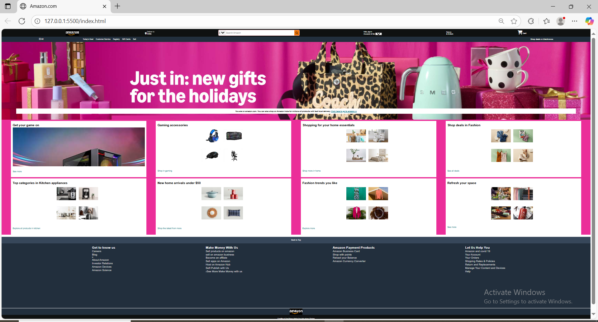

# 🛒 Amazon Clone (HTML + CSS)

A front-end clone of the **Amazon.com** homepage, built using **HTML** and **CSS**.  
This project is created for practice purposes to improve skills in web structure, layout design, and responsive styling.

---

## 📌 Features

- 🖥 **Amazon-like homepage layout**  
- 🎨 **Fully custom styling with CSS**  
- 📦 **Section-based product categories**  
- 📱 **Responsive design for multiple screen sizes**  
- 🏷 **Header, banner, and footer similar to Amazon**  

---

## 🛠 Technologies Used

- **HTML5** – Structure and semantic layout.  
- **CSS3** – Styling and responsive design.  

---

## 📷 Project Screenshot

  

---

## 📂 Project Structure

